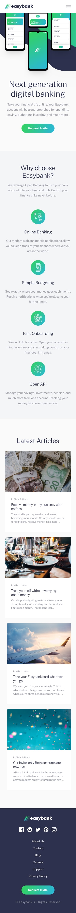

## Table of contents
- [Table of contents](#table-of-contents)
- [Overview](#overview)
- [Features](#features)
  - [Developer's Review](#developers-review)
- [Frontend Mentor](#frontend-mentor)
  - [The challenge](#the-challenge)
  - [Design Picture (Mobile):](#design-picture-mobile)

## Overview

This is a Frontend Mentor challenge. I've applied challenge in NextJS environment rather than static site deployment via HTTP/JavaScript. The site features UI components, modular css designs, and pre-rendered content.

This site is available to view at [https://visionary-cendol-e005e0.netlify.app/](https://visionary-cendol-e005e0.netlify.app/)  

## Frontend Mentor  
### The challenge

Users should be able to:

- View the optimal layout for the site depending on their device's screen size
- See hover states for all interactive elements on the page

Design Picture (Mobile):

| Design | Current | Mobile |
|---|---|---| 
||||

### Developer's Review  

~~~ shell
#1. Open project in VSCode --> install next (project dependency)  
cd easybank-nextjs  
npm install next@13 react@latest react-dom@latest  

#2. In terminal, start the project server  
npm run dev

#3. Open the provided server URL with CTRL + Click. EX: "url: http://localhost:3000"  
~~~  

## Features
- React components utilizing Next.JS framework  
- Mobile responsive website, following design of Frontend Mentor 

